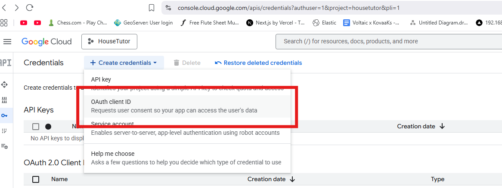
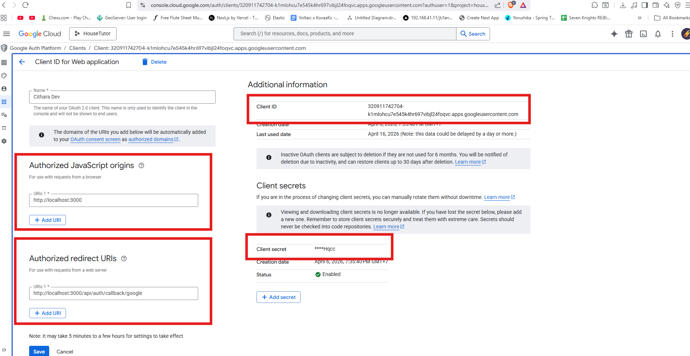

# Google OAuth Setup

Chithara uses Google as its only sign-in provider. You need to create OAuth credentials in Google Cloud Console before users can log in.

---

## 1. Create a Google Cloud project

1. Go to [Google Cloud Console](https://console.cloud.google.com/)
2. Click the project dropdown at the top → **New Project**
3. Give it a name (e.g. `Chithara`) and click **Create**

---

## 2. Enable the Google OAuth API

1. In the left sidebar go to **APIs & Services** → **Library**
2. Search for **Google+ API** or **Google Identity** and enable it

---

## 3. Create OAuth credentials

1. Go to **APIs & Services** → **Credentials**
2. Click **+ Create Credentials** → **OAuth 2.0 Client ID**

3. If prompted, configure the **OAuth consent screen** first:
   - User type: **External**
   - Fill in the app name, support email, and developer email
   - Add your own Google account as a **test user** (required while the app is in testing mode)
   - Save and continue through the remaining steps
4. Back on Credentials, create the client ID:
   - Application type: **Web application**
   - Name: anything (e.g. `Chithara Web`)

---

## 4. Set authorised origins and redirect URIs



Under the client ID you just created, add:

**Authorised JavaScript origins**
```
http://localhost:3000
```

**Authorised redirect URIs**
```
http://localhost:3000/api/auth/callback/google
```

Click **Save**.

---

## 5. Copy credentials into your `.env`

On the credentials page, click your client ID to open it. Copy the values:

```env
GOOGLE_CLIENT_ID=your-client-id.apps.googleusercontent.com
GOOGLE_CLIENT_SECRET=your-client-secret
```

---

## Important: test users

While your app is in **Testing** mode, only Google accounts you explicitly add as test users can sign in. Anyone else will see an "access denied" error.

To add a test user:
1. Go to **APIs & Services** → **OAuth consent screen**
2. Scroll to **Test users** → **+ Add users**
3. Enter the Gmail address of anyone who needs access

To allow any Google account to sign in, publish the app:
1. On the same consent screen page, click **Publish App**
2. Confirm the prompt

> Chithara automatically creates an account on the first sign-in — there is no separate registration step.
