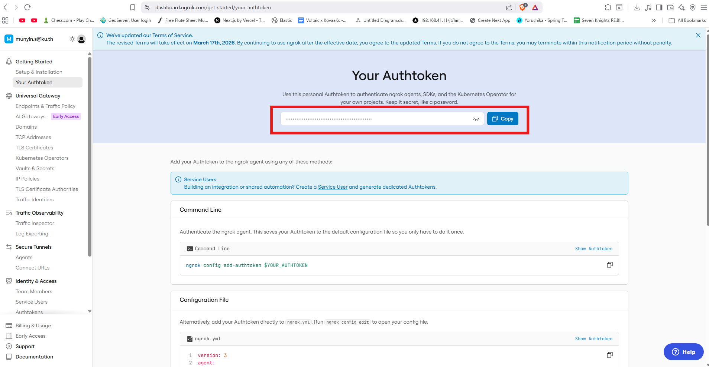

# ngrok Setup

ngrok is **optional**. Chithara works without it by polling the Suno API for generation status. If you set up ngrok, Suno will push results to your backend the moment a song finishes — making the library update faster without waiting for a poll cycle.

---

## How it works

When `SUNO_CALLBACK_URL` is set, each generation request includes a callback URL. Suno calls that URL when the song is ready, and the backend saves it immediately. Without a callback URL, the backend polls `GET /record-info` each time the frontend requests the history status.

---

## Docker setup (recommended)

The `docker-compose.yml` already includes an ngrok container. You just need an auth token.

### 1. Get your auth token

1. Sign up at [ngrok.com](https://ngrok.com)
2. Go to [dashboard.ngrok.com/get-started/your-authtoken](https://dashboard.ngrok.com/get-started/your-authtoken)

3. Copy your token

### 2. Start Docker with ngrok enabled

Add these to your `.env` before running `docker compose up --build`:

```env
NGROK_AUTHTOKEN=your-auth-token
```

Once running, open http://localhost:4040 in your browser. Under **Tunnels** you will see a public URL like:

```
https://xxxx-xx-xx.ngrok-free.app
```

### 3. Set the callback URL

Add the URL to your `.env`:

```env
NGROK_URL=https://xxxx-xx-xx.ngrok-free.app
SUNO_CALLBACK_URL=https://xxxx-xx-xx.ngrok-free.app/api/generate/callback/
```

Then restart the backend container:

```bash
docker compose restart backend
```

> The URL changes every time ngrok restarts unless you have a paid plan with a static domain. Update `.env` and restart the backend each time.

---

## Local setup (no Docker)

If you are running the backend manually:

### 1. Install ngrok

Download from [ngrok.com/download](https://ngrok.com/download) or install via package manager:

```bash
# macOS
brew install ngrok

# Windows (Chocolatey)
choco install ngrok
```

### 2. Connect your auth token

```bash
ngrok config add-authtoken <your-token>
```

### 3. Start the tunnel

```bash
ngrok http 8000
```

### 4. Update your `.env`

Copy the `https://` URL and set:

```env
NGROK_URL=https://xxxx-xx-xx.ngrok-free.app
SUNO_CALLBACK_URL=https://xxxx-xx-xx.ngrok-free.app/api/generate/callback/
```

Restart the Django server after updating `.env`.
