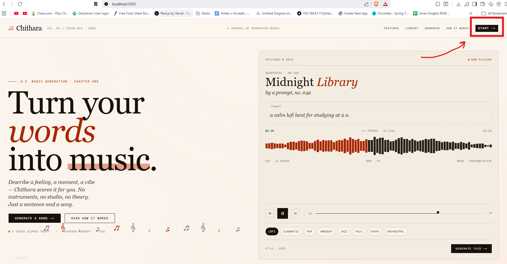
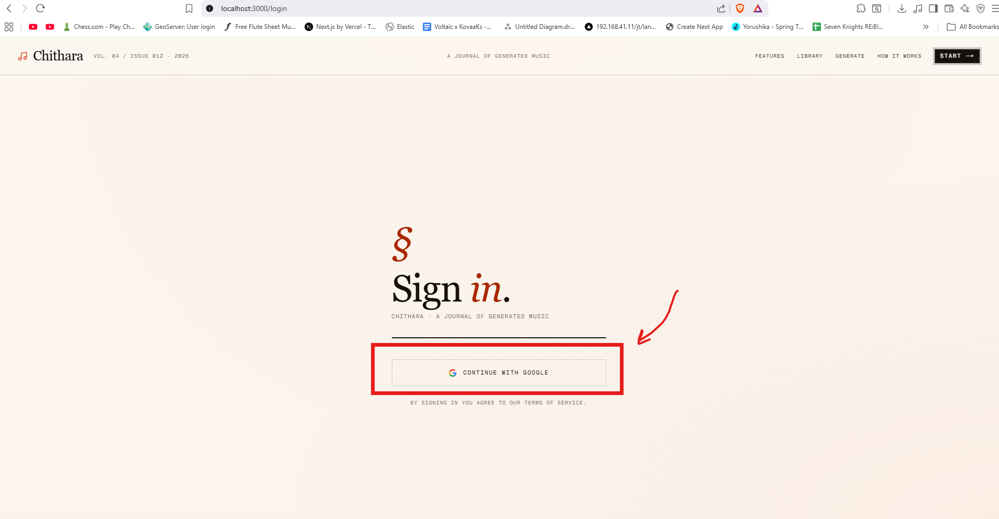

# Using Chithara

A walkthrough of the main features once the app is running at http://localhost:3000.

---

## Signing in

1. Open http://localhost:3000
2. Click Start

3. Click **Sign in / Register with Google**

4. Complete the Google sign-in flow

Your account is created automatically on your first sign-in — there is no separate registration step.

> If you see an "access denied" error, your Google account has not been added as a test user. See [Google OAuth Setup](google-oauth.md#important-test-users).

---

## Generating a song

1. Click **Generate** in the navigation bar (or go to http://localhost:3000/generation)
2. Fill in the form:
   - **Prompt** — describe what you want the song to be about (e.g. *"a rainy afternoon in Tokyo"*)
   - **Style / Genre** — the musical style (e.g. *Lo-fi*, *Rock*, *Jazz*)
   - **Title** — the song title
   - **Instrumental** — toggle on to generate without vocals
3. Click **Generate**

The page will poll for the result automatically. Generation typically takes 30–90 seconds. When it completes, the song appears in your Library.

> Each account has a daily generation limit. The remaining Suno credits are shown at the top of the Library page.

---

## Your library

Go to **Library** to see all songs you have generated.

### Playback

Click **Play** on any song to open the audio player at the bottom of the screen. Controls include:

- Play / pause
- Skip back / forward 10 seconds
- Playback speed (0.5× to 2×)
- Volume and mute

### Download

Click **Download** on any song to save the MP3 to your device.

### Privacy

Songs are **Private** by default. Click **Make Public** to generate a shareable link. Click **Copy Link** to copy the share URL to your clipboard.

Public songs are accessible to anyone with the link at `/songs/{token}` — no account required.

### Delete

Click **Delete** on a song card. You will be asked to confirm before it is removed.

---

## API docs

Interactive API documentation (Swagger UI) is available at:

```
http://localhost:3000/api-docs
```

You can explore and test all endpoints directly from the browser.
